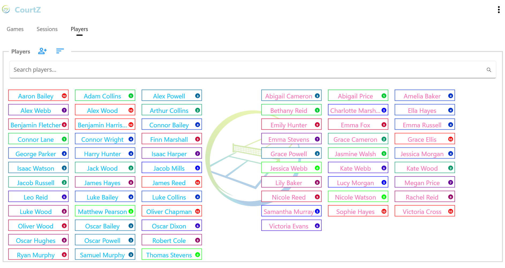
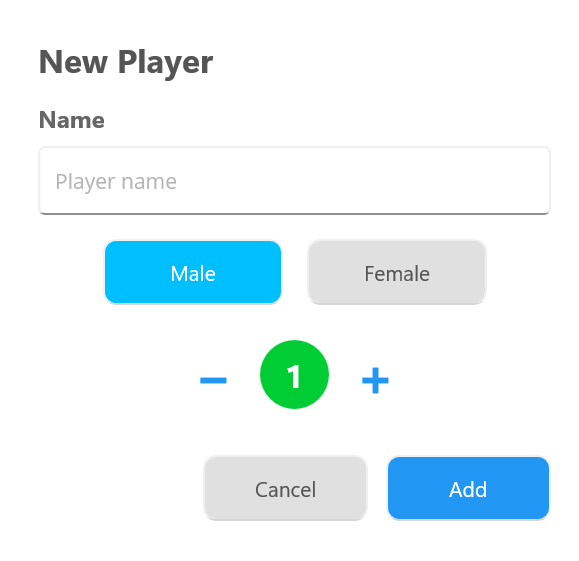

# Players

The **Players** page contains the master player list used by CourtZ.

This is the master record of every player. Session Profiles refer to players in this list rather than storing their own copies.

Because there is only one record for each player, changes such as updating a player's name or Skill Level are automatically reflected wherever that player is used.

If you're organising a one-off session, you can also add guest players directly to a session without adding them to the master player list.

*The Players page showing separate male and female player lists, searchable player records and colour-coded Skill Levels.*

---

## Creating a Player

To add a player:

1. Open the **Players** page.
2. Select **Add**.
3. Enter the player's name.
4. Select **Male** or **Female**.
5. Set the player's Skill Level.
6. Select **Add** to save the player.

*The New Player dialog is used to enter the player's name, select their gender and assign an initial Skill Level.*

The player is now available for use in any Session Profile or session.

---

## Skill Levels

Each player has a Skill Level between **0** and **10**.

* **0** represents a beginner.
* **10** represents an expert player.

CourtZ uses Skill Levels when generating balanced games. They don't need to be exact—choose a value that reasonably reflects the player's current playing ability.

As players improve, you can update their Skill Level at any time.

Player cards are colour-coded to provide a quick visual indication of ability:

* 🟢 Beginner
* 🔵 Intermediate
* 🔴 Expert

---

## Editing Players

Player details can be updated whenever required.

Typical reasons for editing a player include:

* correcting a name
* changing a Skill Level
* updating other player information

Because Session Profiles refer to the master player list, any changes you make are automatically available wherever that player is used.

---

## Deleting Players

To help prevent accidental deletion, players are deleted using a two-step process.

To delete a player:

1. Tap and hold the player's name.
2. A red **Delete** icon appears within the player label.
3. Tap the red **Delete** icon within **3 seconds**.

*Tap and hold a player's name to reveal the Delete icon. The icon disappears after 3 seconds if it is not selected.*

If the Delete icon is not selected within 3 seconds, it disappears and the player is not deleted.

If the player belongs to one or more Session Profiles, CourtZ automatically removes the player from those profiles.

---

## Additional Options

Select **Options** (⋮) to access additional actions for the Players page.

**Delete All Players** permanently removes every player from the master player list.

Use this option with care, as it cannot be undone.

---

## Tips

> **Tip:** Don't worry about assigning perfect Skill Levels. They are intended as a guide for game generation and can be adjusted over time as players improve or as you become more familiar with their playing ability.

---

## Related Topics

* [Session Profiles](03-session-profiles.md)
* [Running a Session](04-running-a-session.md)
* [Game Generation](05-game-generation.md)

---

← [Getting Started](01-getting-started.md) | [🏠 Help Home](00-index.md) | [Session Profiles →](03-session-profiles.md)

