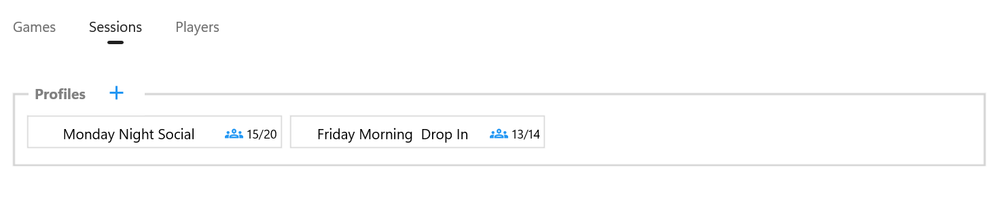
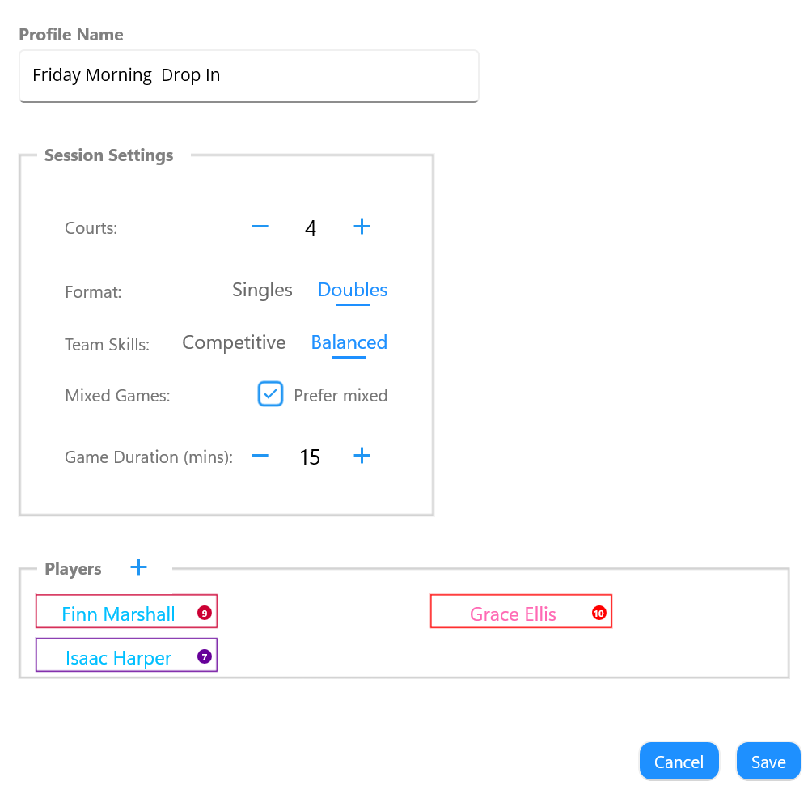
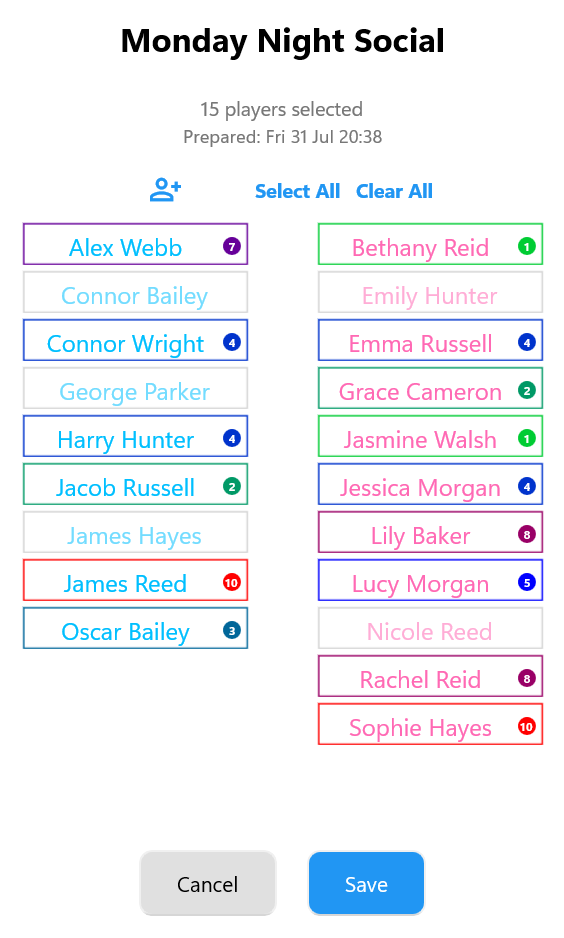

# Session Profiles

Session Profiles define your regular playing sessions, allowing CourtZ to remember the players and game settings used each time the session is run.

A Session Profile stores:

- the regular players for the session
- the most recently recorded attendance
- the game settings used to generate games

It does not store copies of player information. Instead, it refers to players in the master player list.

This means that if you update a player's name or Skill Level on the **Players** page, every Session Profile using that player automatically uses the updated information.

*The Session Profiles page showing the available Session Profiles and the number of players assigned to each profile.*

---

## Creating a Session Profile

To create a Session Profile:

1. Open the **Session Profiles** page.
2. Select **Add**.
3. Enter a name for the Session Profile.
4. Select the regular players.
5. Choose the game settings.
6. Save the Session Profile.

*The Session Profile editor is used to define the regular players and default game settings for a session.*

The Session Profile is now available whenever you start a new session.

---

## Session Settings

Each Session Profile stores the default settings used whenever a new session is started.

These include:

- **Number of courts** – the number of courts available for play.
- **Format** – whether games are generated as Singles or Doubles.
- **Team Skills** – determines how CourtZ balances player abilities when generating games.
- **Balanced** attempts to make both teams equally matched by keeping the total Skill Levels of each team as close as possible.
- **Competitive** attempts to group players of similar Skill Levels together, creating games where all players are of a comparable standard.- **Mixed Games** – whether CourtZ should prefer mixed-gender games when suitable players are available.
- **Game Duration** – the target length of each game before the next round is generated.

These settings are used automatically whenever the Session Profile is started.

If required, they can be temporarily changed during a session using **Options**. Temporary changes affect only the current session and do not modify the Session Profile.

---

## Managing Players

Session Profiles contain references to players in the master player list.

You can:

- add players to the Session Profile
- remove players from the Session Profile

Player details such as names and Skill Levels are managed on the **Players** page.

Any changes made to a player's details are automatically reflected in every Session Profile that includes that player.

---

## Preparing Attendance

Attendance can be recorded before arriving at the venue.

Each Session Profile displays an Attendance indicator showing the number of players currently marked as attending and the total number of players in the profile (for example, **15/20**).

Select the Attendance button to open the Attendance dialog. Select the players expected to attend, then save the attendance.

*The Attendance dialog is used to select the players expected to attend the session. Greyed-out players are currently marked as absent.*

Use Select All or Clear All to quickly mark every player as attending or absent before making individual changes.

The attendance list can be updated whenever players confirm or cancel before the session begins.

---

## Starting a Session

To start a session:

1. Open the **Games** page.
2. Select the required Session Profile.
3. Review today's attendance and make any final changes if required.
4. Select **Start Session**.

CourtZ automatically generates the first round of games using the Session Profile settings and the players marked as attending.

---

## Updating a Session Profile

Session Profiles can be edited whenever your regular session changes.

For example, you might:

- add new regular players
- remove players who no longer attend
- change the number of courts
- adjust the game duration
- change the preferred game mode

Changes are saved immediately and are used the next time the Session Profile is started.

---

## Additional Options

Select **Options** (⋮) to access additional actions for the Session Profiles page.

**Delete All Session Profiles** permanently removes every Session Profile.

This does not affect the master player list.

Existing player records remain available to create new Session Profiles.

---

## Tips

> **Tip:** Create separate Session Profiles for different days, venues or groups of players. Each profile remembers its own players and default game settings.

> **Tip:** Recording attendance before arriving at the venue allows games to be generated immediately when the session starts.

---

## Related Topics

- Players
- Running a Session
- Game Generation
- Options

---

← [Players](02-players.md) | [🏠 Help Home](00-index.md) | [Running a Session →](04-running-a-session.md)