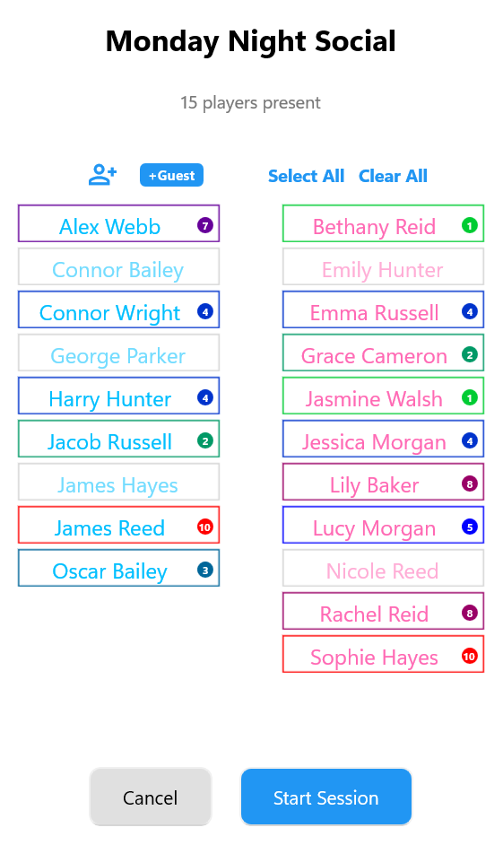
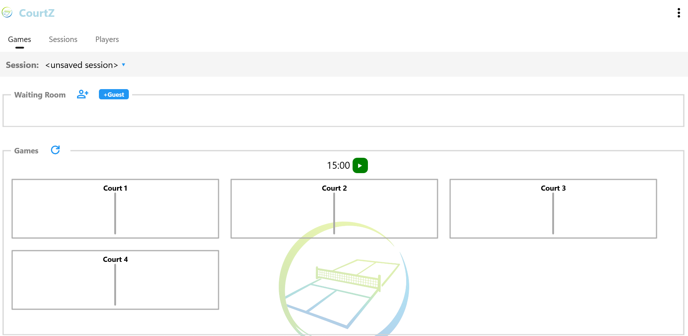
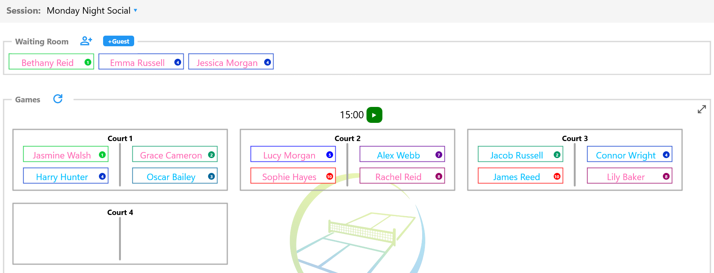

# Running a Session

This section explains how to start a CourtZ session.

You can start a session in one of two ways:

- Using a Session Profile
- Without a Session Profile

Once the session has started, both workflows operate in the same way.

---

## Starting with a Session Profile

Session Profiles provide a quick way to start regular club sessions.

Each Session Profile already contains:

- the players who normally attend
- the game settings for the session

To start a session, open the required **Session Profile**.

The **Attendance** dialog is displayed.

Use the Attendance dialog to prepare today's session by:

- selecting the regular players who are attending
- clearing players who are absent
- adding players from the master player list
- adding guest players

When the player list is complete, select **Start Session**.

*Use the Attendance dialog to select the players attending today's session. Greyed-out players are currently marked as absent.*

CourtZ creates today's session and allocates players to the available courts. If there are more players than available court spaces, the remaining players are placed in the Waiting Room.

### Guest Players

Guest players added from the Attendance dialog become part of today's session.

If they are likely to play again, you can also:

- add them to the master player list
- add them to the current Session Profile

This allows them to be included automatically in future sessions that use this Session Profile.

---

## Starting without a Session Profile

If you are not using a Session Profile, you create today's session directly from the **Games** page.

Choose the required game settings, then add players to the Waiting Room from:

- the master player list
- guest players

When everyone has been added, select the New Game button (↻) to generate the first round of games.

CourtZ creates today's session and allocates players to the available courts. If there are more players than available court spaces, the remaining players stay in the Waiting Room.

When a session is started without using a Session Profile, the session name displays as **`<unsaved session>`**. This indicates that the session is using the default game settings rather than those stored in a Session Profile.

Players can be added directly to the Waiting Room from the master player list or as guest players before play begins.

*A session started without using a Session Profile. Players can be added to the Waiting Room before the first games are generated.*

### Guest Players

Guest players can be added directly to the Waiting Room.

If they become regular players, you can add them to the master player list so they are available for future sessions.

---

## The Waiting Room

The Waiting Room contains players who are waiting to be allocated to a court.

Players are placed in the Waiting Room automatically when:

- there are more players than available court spaces
- they are waiting for their next game
- they are added after the session has started

CourtZ uses the Waiting Room whenever new games are generated, automatically moving waiting players onto available courts.

*The Waiting Room contains players waiting for their next game. As courts become available, CourtZ automatically selects players from the Waiting Room when generating the next round.*

---

## What's Next?

Your session is now running.

Continue to **Game Generation** to learn how CourtZ generates games, rotates players between courts and the Waiting Room, and keeps play balanced throughout the session.

---

← [Session Profiles](03-session-profiles.md) | [🏠 Help Home](00-index.md) | [Game Generation →](05-game-generation.md)