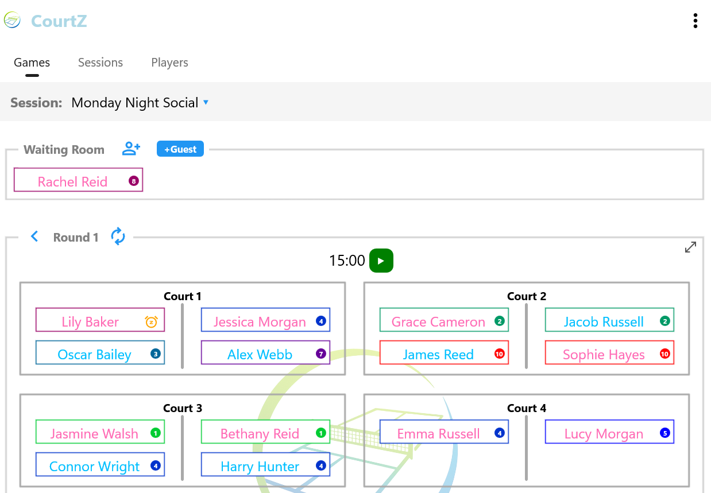

# Game Generation

Game Generation is at the heart of CourtZ.

The first round of games is generated automatically when a session starts. After each round of play, select the **New Game** (refresh) button to generate the next round.

---

## Generating the First Games

When you select **Start Session**, CourtZ automatically generates the first round of games using the current Session Profile settings and the players attending today's session.

Players are allocated to courts and any remaining players are placed in the Waiting Room.

*The Games page showing players on court, the Waiting Room and the controls used to manage the session.*

Players can now move to their allocated courts and begin play.

If you are using the optional Countdown Timer, start it before play begins. An alarm sounds automatically when the selected game duration has elapsed.

---

## Generating the Next Round

When the current round has finished, select the **New Game** (refresh) button.

CourtZ automatically:

- selects the players for the next round
- allocates players to courts
- updates the Waiting Room

The court and player allocation is calculated automatically using the current session settings. Players cannot be assigned to courts manually.

Players can then move to their allocated courts and begin the next round.

Repeat this process until the session has finished.

---

## How Game Generation Works

Each time a new round is generated, CourtZ evaluates the available players and attempts to produce the best possible set of games using the current session settings.

Rather than applying a single rule, CourtZ balances a number of factors, including:

- player Skill Levels
- previous partnerships
- previous opponents
- mixed games preferences
- player waiting time

The importance of each factor depends on the current session settings. For example, **Balanced** Team Skills attempts to produce evenly matched teams by keeping the total Skill Levels of each side as close as possible, while **Competitive** Team Skills attempts to group players of similar ability together.

No two sessions are exactly alike, so the generated games may vary as player attendance changes throughout the session.

The aim is to produce enjoyable, varied and fair games while ensuring that everyone receives regular opportunities to play.

---

## The Waiting Room

The Waiting Room is managed automatically throughout the session.

As each new round is generated, players move between the courts and the Waiting Room.

If there are more players than available court spaces, some players remain in the Waiting Room until they can be included in a later round.

*Players waiting for their next game remain in the Waiting Room until CourtZ allocates them to an available court.*

---

## Players Joining or Leaving

Players can be added to or removed from a session at any time.

For example, you can:

- add a late-arriving player to the Waiting Room
- remove a player who leaves early

The updated player list is used the next time a new round of games is generated.

---

## Player Availability

Before generating the next round, you can indicate whether players wish to continue playing.

### Players currently on court

Tap a player to cycle through three availability states:

- **Normal** – the player is available for selection in the next round.
- **Rest** – the player completes the current game, then sits out the next round.
- **Exit** – the player completes the current game, then leaves the session and is not included in subsequent rounds.

Tap the player again to return to the normal playing state.

*Players on court can be marked to rest after their current game or to leave the session.*

### Players in the Waiting Room

Players in the Waiting Room can also be tapped to control their availability.

- **Normal** – the player is available for selection in the next round.
- **Rest** – the player skips the next round and remains in the Waiting Room.

Each tap alternates between these two states, allowing players to take one or more consecutive rounds off before returning to play.

---

## Saving a Session Profile

If you start a session without using a Session Profile, or you have adjusted the current session to create a setup you would like to use again, you can save it as a Session Profile.

Select **Options** (⋮), then choose **Save Session Profile**.

You can:

- create a new Session Profile
- overwrite an existing Session Profile

The Session Profile stores:

- the selected players
- the current game settings

You can use the saved Session Profile to start future sessions without recreating the same setup.

---

## What's Next?

The current session settings can be changed at any time using **Options**. These changes affect future games generated during the current session only and do not modify the original Session Profile.

Continue to **Display Games** to learn how to present court allocations to players, or **Countdown Timer** to learn how to use the optional timer.

---

← [Running a Session](04-running-a-session.md) | [🏠 Help Home](00-index.md) | [Display Games →](06-display-games.md)