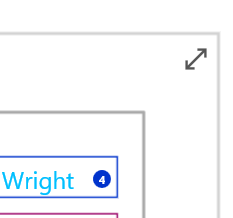
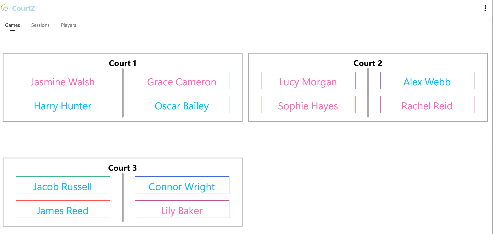

# Games Display

Games Display provides a simplified, full-screen view of the current court allocations.

It is designed to be easy to read from a distance, making it ideal for displaying on a tablet, television or projector during a session.

---

## Opening Games Display

From the **Games** page, select the **Games Display** button in the upper-right corner of the Games panel.

*Select the Games Display button to open the player display.*

The Games Display page shows the current allocation of players to each court.

*Games Display presents the current court allocations in a clear, easy-to-read format.*

Whenever a new round of games is generated, the display updates automatically.

---

## During Play

Games Display is intended to remain visible throughout the session.

Players can quickly identify:

- their court number
- their playing partners
- their opponents

Because the display updates automatically after each new round is generated, there is no need to refresh the page manually.

---

## Between Rounds

Games Display is intended for players while games are in progress.

When a round has finished, return to the **Games** page to prepare the next round.

Before generating the next round you can:

- remove players who are leaving the session
- add any late-arriving players
- mark players who wish to sit out the next round
- review the Waiting Room

When you are satisfied that the player list is correct, select the ↻ button to generate the next round.

Games Display can then be reopened to show the updated court allocations to players.

---

## Player Skill Levels

Player Skill Levels are intentionally hidden in Games Display.

Skill Levels continue to be used by CourtZ when generating games, but they are not displayed to players during the session.

This allows players to focus on finding their court and beginning their next game.

---

## Using a Larger Display

Games Display works well on larger tablets and can also be displayed on a television or projector using your device's screen-casting or screen-mirroring features.

This allows all players to view the current court allocations without gathering around a single device.

---

## What's Next?

Continue to **Countdown Timer** to learn how to use the optional timer during your session.

---

← [Game Generation](05-game-generation.md) | [🏠 Help Home](00-index.md) | [Countdown Timer →](07-countdown-timer.md)