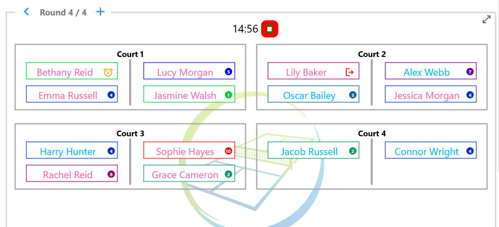

# Countdown Timer

The optional Countdown Timer helps keep games to a consistent duration throughout a session.

After each new round has been generated, the timer counts down the configured game duration. When the countdown reaches zero, an alarm sounds to indicate that it is time to prepare the next round.

---

## Starting the Timer

After generating a new round of games and once players have moved to their courts, select **Start Timer**.

The timer uses the game duration configured for the current session.

*The Countdown Timer counts down the remaining game time. Players can also be marked to rest after the current game or leave the session before the next round is generated.*

---

## Changing the Game Duration

When using a Session Profile, the game duration is normally taken from the Session Profile settings.

If required, you can temporarily override the game duration for the current session using **Options**.

Changing the game duration affects only the current session. The original Session Profile is unchanged and will be used the next time the profile is started.

---

## When Time Expires

When the countdown reaches zero, an alarm sounds to indicate that the current round has finished.

Return to the Games page. If any players wish to rest or leave the session, update their availability before selecting the + button to generate the next round.

The Countdown Timer is optional. If games finish before the timer expires, simply generate the next round when everyone is ready.

---

## Tips

> **Tip:** The Countdown Timer is intended as a guide. If a game finishes early or runs slightly over time, simply generate the next round when the players are ready.

---

## What's Next?

Continue to **Options** to learn about the settings available during a session.

---

← [Games Display](06-display-games.md) | [🏠 Help Home](00-index.md) | [Options →](08-options.md)