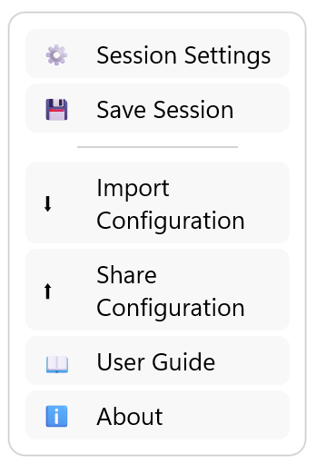
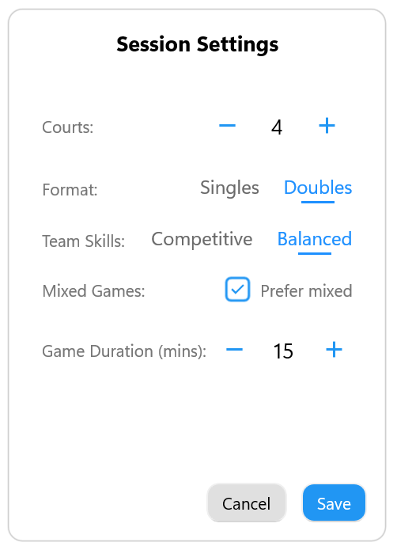

# Options

The **Options** menu provides access to session settings, session management and application information.

Select **Options** (⋮) from the **Games** page to open the Options menu.

*The Options menu provides access to session settings, saving sessions, configuration management and application information.*

---

## Session Settings

Select **Session Settings** to temporarily change the game generation settings for the current session.

Session Profiles provide the default settings for a session. Once play has started, you can override those settings using **Session Settings**.

Depending on your session, you can change settings such as:

- number of courts
- game duration
- Singles or Doubles
- Team Skills
- mixed games preferences

The updated settings are used the next time the ↻ button is selected.

These changes affect only the current session. They do not modify the original Session Profile.

*Session Settings allows the game generation settings for the current session to be adjusted.*

---

## Save Session

Select **Save Session** to save the current session as a Session Profile.

You can:

- create a new Session Profile
- overwrite an existing Session Profile

This is useful if you started a session without using a Session Profile, or if you have adjusted the current session and would like to use the same setup again.

---

## Import Configuration

Select **Import Configuration** to restore a previously exported CourtZ configuration.

A configuration contains:

- players
- Session Profiles
- application settings

Importing a configuration replaces the current CourtZ data.

---

## Share Configuration

Select **Share Configuration** to export the current CourtZ configuration.

The exported configuration can be used to:

- create a backup
- transfer CourtZ data to another device
- share a club configuration with another organiser

---

## About

Select **About** to view information about your copy of CourtZ.

The About dialog displays:

- CourtZ version
- club name
- email address
- licence status
- licence type
- issue date (licensed copies)
- expiry date (where applicable)

If you are using the trial version, you can also activate your purchased licence from the About dialog.

The About dialog also provides access to the CourtZ website.

---

## Tips

> **Tip:** Temporary changes made using **Session Settings** affect only the current session. To make permanent changes, edit the Session Profile instead.

> **Tip:** Regularly exporting your configuration provides a convenient backup of your players, Session Profiles and application settings.

---

## What's Next?

Continue to **Configuration** to learn about the application settings.

---

← [Countdown Timer](07-countdown-timer.md) | [🏠 Help Home](00-index.md) | [Configuration →](09-configuration.md)